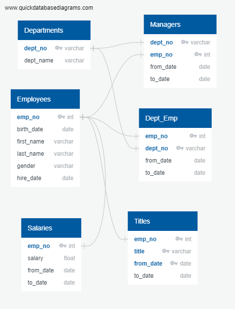

# Pewlett-Hackard-Analysis

## Project and Challenge Overview
The project consisted of determining the total number of employees per title who will be retiring and identifying the employees who are eligible to participate in a mentorship program.

## Steps taken

1. The *employees* table was filtered to show only employees whose birth date falls between 1/1/1952 and 12/31/1955 and were hired between 1985 and 1988, generating table *retirement_info*;
2. A table of current employees (*current_emp*) was created by filtering *retirement_info* to find current employees only;
3. To find the list of current employees close to retirement per title, table *title* was joined to *current_emp* and partitioned to make sure no employees were duplicated (due to a change in title), and only the most recent title was considered, generating table *deliverable_1_retirees_info*;
4. This table was grouped by title to find the counts of open positions there will be for each title after all employees retire, creating table *deliverable_1_retirees_by_title*;
5. Finally, to find the list of employees (and their titles) that are eligible to participate in the mentorship program, the *employees* table was joined with *title* and filtered for "*to_date"* column to contain only the date *'9999-01-01'*, meaning that that is a current employee. The output file was *deliverable_2_mentorship_eligibility*.

## Resources
- Data source:
    - departments.csv
    - dept_emp.csv
    - dept_manager.csv
    - employees.csv
    - salaries.csv
    - titles.csv
- Software: PostgreSQL 11, pgAdmin 4, QuickDBD, Visual Studio Code 1.43.1

## Results
The analysis has shown that:

* There are 33,118 employees that are close to or at retirement age;

* The majority of job titles that will need replacement are Senior Engineers and Senior Staff;
    
* A total of 1,549 employees are eligible to participate in the Mentorship Program.

## Entity Relationship Diagram
